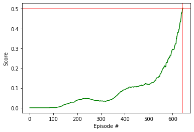

#  Collaboration and Competition
Udacity project for collaborative and competitive Multi Agent Reinforcement Learning

## This repository outlines the steps taken to resolve the Collaboration and Competition Tennis environment using Unity ML-Agents and Pytorch.

# Environment Setup
## Anaconda
In order to set up the environment follow the instructions on the Udacity deep reinforcement learning course.

https://github.com/udacity/deep-reinforcement-learning

## Temmis Environment for unity
The tennis environment for the Collaboration and Competition task can be setup by following the instructions on the git-hub page for the Collaboration and Competition project:

https://github.com/udacity/deep-reinforcement-learning/tree/master/p3_collab-compet

# Running The Agent
In order to run the agent jupyter notebooks is needed the best way to set up teh environment is to insall anaconda: 
https://www.anaconda.com/distribution/

After creating the environment and downloading the Unity environment open the Tennis_DDPG.ipynb file in anaconda and run all cells of the notebook.

# Learning Agent
The learning agent used for this project is a Deep Deterministic Policy Gradient agent. This agent uses 2 neural networks known as the Actor network and the critic network. The actor network performs actions based off the current policy, producing the actions directly instead of producing probabilities. The Critic network provides feedback on the performance of the actor network in order to improve the Actors policy.

The tenis environment requires 2 agent to be trained with a Multi-Agent Reinforcement Learning (MARL) techneque.

## Neural Netsork Structure
Both the actor and the critic have the same internal hidden layer values in this project, however the output layers differ

- Input: State Size = 8
- Hidden Layer 1 = 500
- Hidden Layer 2 = 500

- Output layer Actor: Action Size = 2
(Maps the states to actions)
- Output Layer Critic: 1 (maps the (state, action) pairs to Q-values)

# Results

The graph below shows the results of the training of the agent.

As can me seen the average score goes above 0.5 at episode 642
